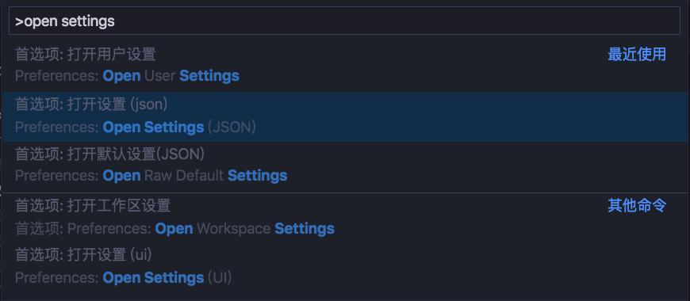

# Mac下安装go 

### 1.安装go

```shell
brew update 

brew install git 

brew install mercurial 

brew install go 
```


### 2.配置环境变量 

```bash
export GOPATH=$HOME/MyFile/go 

export GOROOT=/usr/local/Cellar/go/1.12.6/libexec 

export PATH=$PATH:$GOPATH/bin 

export PATH=$PATH:$GOROOT/bin 
```


```bash
source ~/.profile or ~/.bashrc or source ~/.zshrc 
```


### 3.查看环境变量 

```shell
go env 
```


# **vscode安装go开发环境**


### 1.先装go扩展 


### 2.User Settings里配置go环境 

> File -> Preference -> Setting ->搜索setting.json -> Edit in settings.json   打开永红配置



```json
{ 

	"files.autoSave": "onFocusChange", 

	"editor.fontSize": 14, 

	"go.goroot": "/usr/local/Cellar/go/1.12.6/libexec", 

	"go.gopath": "$HOME/MyFile/go" 

} 
```


### 3.命令行安装gobuildutil 

> 由于墙的原因直接安装完之后，vscode会提示你现在有好几个插件安装失败 


```
Installing github.com/mdempsky/gocode FAILED 

Installing github.com/ramya-rao-a/go-outline FAILED 

Installing github.com/acroca/go-symbols FAILED 

Installing golang.org/x/tools/cmd/guru FAILED 

Installing golang.org/x/tools/cmd/gorename FAILED 

Installing github.com/stamblerre/gocode FAILED 

Installing github.com/rogpeppe/godef SUCCEEDED 

Installing github.com/sqs/goreturns FAILED 

Installing golang.org/x/lint/golint FAILED 
```


```shell
go get -v -u github.com/golang/tools/go/buildutil 

mkdir $GOPATH/src/golang.org 

ln -s $GOPATH/src/github.com/golang $GOPATH/src/golang.org/x 


cd $GOPATH/src/golang.org/x/tools/go/buildutil 

go install 

```


### 4.命令行安装lint

> 在**$GOPATH/src/github.com/golang/**目录下clone 

```shell
git clone https://github.com/golang/lint.git 


go install github.com/golang/lint/golint    

或 go install golang.org/x/lint/golint 
```


### 其他的可以在vscode中安装 


================================================================== 


参考： 

https://www.jianshu.com/p/c1647899c8e7

https://www.jianshu.com/p/83beca927c9e

https://www.cnblogs.com/yangxiaoyi/p/9692369.html